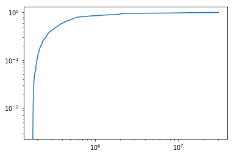
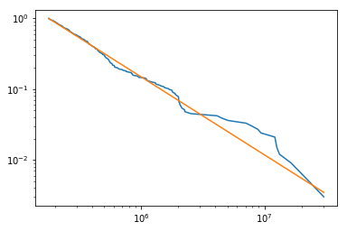

# Network Analysis of Campaign Contributions

```python
import pandas as pd 
import numpy as np
import matplotlib.pyplot as plt
import powerlaw as pl
```

Get the all candidates file for 2019/2020 and put it in a dataframe.


```python
column_indexes = np.linspace(start=0, stop=29, num=30, dtype=int)
column_indexes = np.delete(column_indexes, [27])
```


```python
column_indexes
```


    array([ 0,  1,  2,  3,  4,  5,  6,  7,  8,  9, 10, 11, 12, 13, 14, 15, 16,
           17, 18, 19, 20, 21, 22, 23, 24, 25, 26, 28, 29])


```python
data = pd.read_csv("https://www.fec.gov/files/bulk-downloads/2020/weball20.zip", delimiter="|", usecols=column_indexes)
column_names = ["candidate_id", "candidate_name", "incumbant_challenger", "party_code", "party_affiliation",
               "total_receipts", "transfers_to_cand", "total_disb", "transfers_from", "beginning_cash",
               "ending_cash", "contributions_from_candidate", "loans_from_candidate", "other_loans", "cand_loan_repay",
               "other_loan_repay", "debts_owed", "total_indiv_contributions", "candidate_state", "candidate_district",
               "special_election", "primary_election", "runoff_election", "general_election", "gen_election_perc",
               "contributions_from_other_political_committees", "contributions_from_party_committees",
               "refunds_to_indiv", "refunds_to_committees"]
data.columns = column_names
data.head()
```


<div>
<style scoped>
    .dataframe tbody tr th:only-of-type {
        vertical-align: middle;
    }

    .dataframe tbody tr th {
        vertical-align: top;
    }

    .dataframe thead th {
        text-align: right;
    }
</style>
<table border="1" class="dataframe">
  <thead>
    <tr style="text-align: right;">
      <th></th>
      <th>candidate_id</th>
      <th>candidate_name</th>
      <th>incumbant_challenger</th>
      <th>party_code</th>
      <th>party_affiliation</th>
      <th>total_receipts</th>
      <th>transfers_to_cand</th>
      <th>total_disb</th>
      <th>transfers_from</th>
      <th>beginning_cash</th>
      <th>...</th>
      <th>candidate_district</th>
      <th>special_election</th>
      <th>primary_election</th>
      <th>runoff_election</th>
      <th>general_election</th>
      <th>gen_election_perc</th>
      <th>contributions_from_other_political_committees</th>
      <th>contributions_from_party_committees</th>
      <th>refunds_to_indiv</th>
      <th>refunds_to_committees</th>
    </tr>
  </thead>
  <tbody>
    <tr>
      <th>0</th>
      <td>H6AK00045</td>
      <td>YOUNG, DONALD E</td>
      <td>I</td>
      <td>2</td>
      <td>REP</td>
      <td>186229.32</td>
      <td>71528.54</td>
      <td>48528.63</td>
      <td>0.00</td>
      <td>116720.12</td>
      <td>...</td>
      <td>0</td>
      <td>NaN</td>
      <td>NaN</td>
      <td>NaN</td>
      <td>NaN</td>
      <td>NaN</td>
      <td>58500.0</td>
      <td>0.0</td>
      <td>0.0</td>
      <td>0.0</td>
    </tr>
    <tr>
      <th>1</th>
      <td>H8AK01031</td>
      <td>NELSON, THOMAS JOHN</td>
      <td>C</td>
      <td>2</td>
      <td>REP</td>
      <td>0.00</td>
      <td>0.00</td>
      <td>466.51</td>
      <td>0.00</td>
      <td>466.51</td>
      <td>...</td>
      <td>0</td>
      <td>NaN</td>
      <td>NaN</td>
      <td>NaN</td>
      <td>NaN</td>
      <td>NaN</td>
      <td>0.0</td>
      <td>0.0</td>
      <td>0.0</td>
      <td>0.0</td>
    </tr>
    <tr>
      <th>2</th>
      <td>H8AK00140</td>
      <td>GALVIN, ALYSE</td>
      <td>C</td>
      <td>3</td>
      <td>IND</td>
      <td>30376.65</td>
      <td>0.00</td>
      <td>9095.03</td>
      <td>0.00</td>
      <td>6245.09</td>
      <td>...</td>
      <td>0</td>
      <td>NaN</td>
      <td>NaN</td>
      <td>NaN</td>
      <td>NaN</td>
      <td>NaN</td>
      <td>0.0</td>
      <td>0.0</td>
      <td>0.0</td>
      <td>0.0</td>
    </tr>
    <tr>
      <th>3</th>
      <td>H0AL01055</td>
      <td>CARL, JERRY LEE, JR</td>
      <td>O</td>
      <td>2</td>
      <td>REP</td>
      <td>387592.00</td>
      <td>0.00</td>
      <td>7528.45</td>
      <td>0.00</td>
      <td>0.00</td>
      <td>...</td>
      <td>1</td>
      <td>NaN</td>
      <td>NaN</td>
      <td>NaN</td>
      <td>NaN</td>
      <td>NaN</td>
      <td>2700.0</td>
      <td>0.0</td>
      <td>0.0</td>
      <td>0.0</td>
    </tr>
    <tr>
      <th>4</th>
      <td>H4AL01123</td>
      <td>BYRNE, BRADLEY ROBERTS</td>
      <td>I</td>
      <td>2</td>
      <td>REP</td>
      <td>544643.34</td>
      <td>19259.14</td>
      <td>1619368.36</td>
      <td>1504815.73</td>
      <td>1074725.02</td>
      <td>...</td>
      <td>1</td>
      <td>NaN</td>
      <td>NaN</td>
      <td>NaN</td>
      <td>NaN</td>
      <td>NaN</td>
      <td>464813.2</td>
      <td>0.0</td>
      <td>0.0</td>
      <td>2500.0</td>
    </tr>
  </tbody>
</table>
<p>5 rows × 29 columns</p>
</div>


## EDA

### Basic Info


```python
data.info()
```

    <class 'pandas.core.frame.DataFrame'>
    RangeIndex: 2166 entries, 0 to 2165
    Data columns (total 29 columns):
    candidate_id                                     2166 non-null object
    candidate_name                                   2166 non-null object
    incumbant_challenger                             2102 non-null object
    party_code                                       2166 non-null int64
    party_affiliation                                2165 non-null object
    total_receipts                                   2166 non-null float64
    transfers_to_cand                                2166 non-null float64
    total_disb                                       2166 non-null float64
    transfers_from                                   2166 non-null float64
    beginning_cash                                   2166 non-null float64
    ending_cash                                      2166 non-null float64
    contributions_from_candidate                     2166 non-null float64
    loans_from_candidate                             2166 non-null float64
    other_loans                                      2166 non-null float64
    cand_loan_repay                                  2166 non-null float64
    other_loan_repay                                 2166 non-null float64
    debts_owed                                       2166 non-null float64
    total_indiv_contributions                        2166 non-null float64
    candidate_state                                  2166 non-null object
    candidate_district                               2166 non-null int64
    special_election                                 0 non-null float64
    primary_election                                 0 non-null float64
    runoff_election                                  0 non-null float64
    general_election                                 0 non-null float64
    gen_election_perc                                0 non-null float64
    contributions_from_other_political_committees    2166 non-null float64
    contributions_from_party_committees              2166 non-null float64
    refunds_to_indiv                                 2166 non-null float64
    refunds_to_committees                            2166 non-null float64
    dtypes: float64(22), int64(2), object(5)
    memory usage: 490.8+ KB


The columns "special_election", "primary_election", "runoff_election", "general_election", and "gen_election_perc" can be deleted because they do not contain any non-null values.


```python
data = data.drop(labels=["special_election", "primary_election", "runoff_election", "general_election", "gen_election_perc"],
                axis=1)
data.info()
```

    <class 'pandas.core.frame.DataFrame'>
    RangeIndex: 2166 entries, 0 to 2165
    Data columns (total 24 columns):
    candidate_id                                     2166 non-null object
    candidate_name                                   2166 non-null object
    incumbant_challenger                             2102 non-null object
    party_code                                       2166 non-null int64
    party_affiliation                                2165 non-null object
    total_receipts                                   2166 non-null float64
    transfers_to_cand                                2166 non-null float64
    total_disb                                       2166 non-null float64
    transfers_from                                   2166 non-null float64
    beginning_cash                                   2166 non-null float64
    ending_cash                                      2166 non-null float64
    contributions_from_candidate                     2166 non-null float64
    loans_from_candidate                             2166 non-null float64
    other_loans                                      2166 non-null float64
    cand_loan_repay                                  2166 non-null float64
    other_loan_repay                                 2166 non-null float64
    debts_owed                                       2166 non-null float64
    total_indiv_contributions                        2166 non-null float64
    candidate_state                                  2166 non-null object
    candidate_district                               2166 non-null int64
    contributions_from_other_political_committees    2166 non-null float64
    contributions_from_party_committees              2166 non-null float64
    refunds_to_indiv                                 2166 non-null float64
    refunds_to_committees                            2166 non-null float64
    dtypes: float64(17), int64(2), object(5)
    memory usage: 406.2+ KB


```python
data.describe()
```


<div>
<style scoped>
    .dataframe tbody tr th:only-of-type {
        vertical-align: middle;
    }

    .dataframe tbody tr th {
        vertical-align: top;
    }

    .dataframe thead th {
        text-align: right;
    }
</style>
<table border="1" class="dataframe">
  <thead>
    <tr style="text-align: right;">
      <th></th>
      <th>party_code</th>
      <th>total_receipts</th>
      <th>transfers_to_cand</th>
      <th>total_disb</th>
      <th>transfers_from</th>
      <th>beginning_cash</th>
      <th>ending_cash</th>
      <th>contributions_from_candidate</th>
      <th>loans_from_candidate</th>
      <th>other_loans</th>
      <th>cand_loan_repay</th>
      <th>other_loan_repay</th>
      <th>debts_owed</th>
      <th>total_indiv_contributions</th>
      <th>candidate_district</th>
      <th>contributions_from_other_political_committees</th>
      <th>contributions_from_party_committees</th>
      <th>refunds_to_indiv</th>
      <th>refunds_to_committees</th>
    </tr>
  </thead>
  <tbody>
    <tr>
      <th>count</th>
      <td>2164.000000</td>
      <td>2.164000e+03</td>
      <td>2.164000e+03</td>
      <td>2.164000e+03</td>
      <td>2.164000e+03</td>
      <td>2.164000e+03</td>
      <td>2.164000e+03</td>
      <td>2164.000000</td>
      <td>2.164000e+03</td>
      <td>2164.000000</td>
      <td>2164.000000</td>
      <td>2164.000000</td>
      <td>2.164000e+03</td>
      <td>2.164000e+03</td>
      <td>2164.000000</td>
      <td>2164.000000</td>
      <td>2164.000000</td>
      <td>2.164000e+03</td>
      <td>2164.000000</td>
    </tr>
    <tr>
      <th>mean</th>
      <td>1.595656</td>
      <td>1.633161e+05</td>
      <td>3.521963e+04</td>
      <td>7.922373e+04</td>
      <td>1.723647e+04</td>
      <td>2.718607e+05</td>
      <td>3.559541e+05</td>
      <td>723.769644</td>
      <td>1.236781e+04</td>
      <td>104.345148</td>
      <td>1008.671567</td>
      <td>28.992380</td>
      <td>8.481910e+04</td>
      <td>8.705646e+04</td>
      <td>8.328558</td>
      <td>24063.974875</td>
      <td>25.768521</td>
      <td>1.621854e+03</td>
      <td>165.725037</td>
    </tr>
    <tr>
      <th>std</th>
      <td>0.610131</td>
      <td>1.113348e+06</td>
      <td>5.858324e+05</td>
      <td>4.788907e+05</td>
      <td>3.332413e+05</td>
      <td>9.699501e+05</td>
      <td>1.397306e+06</td>
      <td>9315.156410</td>
      <td>3.559533e+05</td>
      <td>4332.556855</td>
      <td>11178.293660</td>
      <td>840.878511</td>
      <td>6.387014e+05</td>
      <td>6.236569e+05</td>
      <td>10.734113</td>
      <td>66236.356204</td>
      <td>327.953980</td>
      <td>2.385406e+04</td>
      <td>2152.631797</td>
    </tr>
    <tr>
      <th>min</th>
      <td>1.000000</td>
      <td>-9.000000e+02</td>
      <td>0.000000e+00</td>
      <td>-2.105481e+04</td>
      <td>0.000000e+00</td>
      <td>-4.170781e+04</td>
      <td>-4.187281e+04</td>
      <td>0.000000</td>
      <td>0.000000e+00</td>
      <td>0.000000</td>
      <td>0.000000</td>
      <td>0.000000</td>
      <td>-6.000000e+00</td>
      <td>-9.000000e+02</td>
      <td>0.000000</td>
      <td>0.000000</td>
      <td>0.000000</td>
      <td>-4.150600e+04</td>
      <td>-3000.000000</td>
    </tr>
    <tr>
      <th>25%</th>
      <td>1.000000</td>
      <td>0.000000e+00</td>
      <td>0.000000e+00</td>
      <td>0.000000e+00</td>
      <td>0.000000e+00</td>
      <td>7.002000e+01</td>
      <td>6.349750e+01</td>
      <td>0.000000</td>
      <td>0.000000e+00</td>
      <td>0.000000</td>
      <td>0.000000</td>
      <td>0.000000</td>
      <td>0.000000e+00</td>
      <td>0.000000e+00</td>
      <td>1.000000</td>
      <td>0.000000</td>
      <td>0.000000</td>
      <td>0.000000e+00</td>
      <td>0.000000</td>
    </tr>
    <tr>
      <th>50%</th>
      <td>2.000000</td>
      <td>3.000000e+02</td>
      <td>0.000000e+00</td>
      <td>2.095935e+03</td>
      <td>0.000000e+00</td>
      <td>4.972250e+03</td>
      <td>4.983180e+03</td>
      <td>0.000000</td>
      <td>0.000000e+00</td>
      <td>0.000000</td>
      <td>0.000000</td>
      <td>0.000000</td>
      <td>0.000000e+00</td>
      <td>0.000000e+00</td>
      <td>4.000000</td>
      <td>0.000000</td>
      <td>0.000000</td>
      <td>0.000000e+00</td>
      <td>0.000000</td>
    </tr>
    <tr>
      <th>75%</th>
      <td>2.000000</td>
      <td>6.505836e+04</td>
      <td>0.000000e+00</td>
      <td>4.840190e+04</td>
      <td>0.000000e+00</td>
      <td>1.033310e+05</td>
      <td>2.055099e+05</td>
      <td>0.000000</td>
      <td>0.000000e+00</td>
      <td>0.000000</td>
      <td>0.000000</td>
      <td>0.000000</td>
      <td>2.634605e+04</td>
      <td>1.757931e+04</td>
      <td>11.000000</td>
      <td>3500.000000</td>
      <td>0.000000</td>
      <td>0.000000e+00</td>
      <td>0.000000</td>
    </tr>
    <tr>
      <th>max</th>
      <td>3.000000</td>
      <td>3.030418e+07</td>
      <td>2.213395e+07</td>
      <td>1.080049e+07</td>
      <td>1.041500e+07</td>
      <td>1.929290e+07</td>
      <td>4.076219e+07</td>
      <td>250000.000000</td>
      <td>1.170000e+07</td>
      <td>200000.000000</td>
      <td>250000.000000</td>
      <td>37154.820000</td>
      <td>1.744325e+07</td>
      <td>1.818630e+07</td>
      <td>53.000000</td>
      <td>694283.000000</td>
      <td>6250.000000</td>
      <td>1.047184e+06</td>
      <td>62300.000000</td>
    </tr>
  </tbody>
</table>
</div>


### Total Receipts


```python
plt.figure(1, figsize=(5, 5))
plt.subplot(111)
plt.hist(data.total_receipts, bins=50)
plt.show()
```


```python
fit = pl.Fit(data.total_receipts)
fit.distribution_compare("power_law", "lognormal")
```

    Values less than or equal to 0 in data. Throwing out 0 or negative values
    Calculating best minimal value for power law fit
    /anaconda/lib/python3.6/site-packages/powerlaw.py:700: RuntimeWarning: invalid value encountered in true_divide
      (Theoretical_CDF * (1 - Theoretical_CDF))
    /anaconda/lib/python3.6/site-packages/powerlaw.py:700: RuntimeWarning: invalid value encountered in true_divide
      (Theoretical_CDF * (1 - Theoretical_CDF))


    (0.003935971724256859, 0.8402119727346593)


```python
fit.alpha
```


    2.1011486627719043


```python
fit.plot_pdf()
```


    <matplotlib.axes._subplots.AxesSubplot at 0x102866a6d8>


```python
fit.plot_cdf()
```


    <matplotlib.axes._subplots.AxesSubplot at 0x101eec8ef0>





```python
fig = fit.plot_ccdf()
fit.power_law.plot_ccdf(ax=fig)
```


    <matplotlib.axes._subplots.AxesSubplot at 0x101fb585f8>





```python
plt.hist(data.party_code)
```